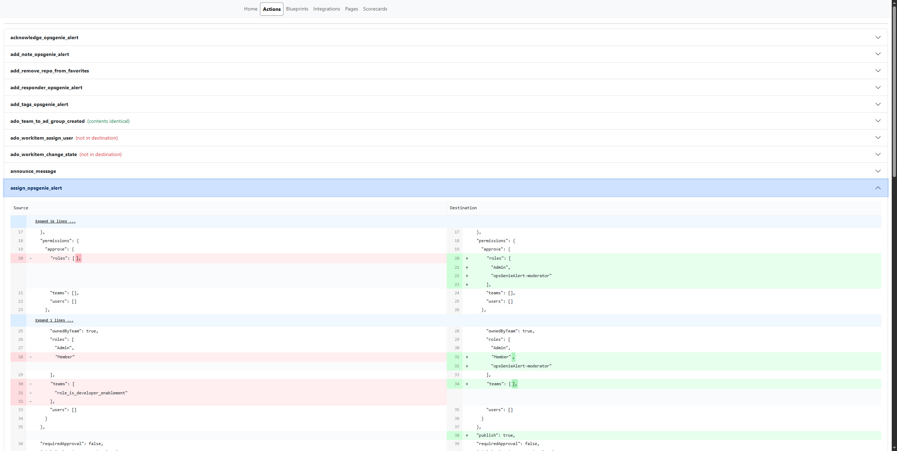

# Compare Organizations

This repository can be used to retrieve the configuration data for a given [Port](getport.io) organization, as well as comparing that configuration data to another organization (such as when confirming successful migration from one organization/environment to another).

## Getting Started

Clone the repository locally, and install dependencies:

```bash
npm install
```

Create one `.cjs` file per environment (Port organization) for both the source and destination in `/src/envs/`. It should follow this format:

```js
// file: /src/envs/dev.cjs
const portConfig = {
  clientId: "string",
  clientSecret: "string",
  envName: "source" | "dest",
  portDomain: "https://api.port.io/v1" | "https://api.us.port.io/v1",
};

module.exports = portConfig;
```

To retrieve your clientId and clientSecret, open your [Port application}(https://app.port.io). Click on the "..." button in the top right corner, and select "Credentials". These values can be found on the "Organization" tab.

**Note:** This project is only intended to compare two environments at a time, as the output for file differences only contains a left (source) and right (destination) pane.

Execute the configuration data retrieval:

```bash
npm run dev
```

Assuming two configured environments (dev and prod), you should see the following file structure generated:

```
/port_organization_comparison
└── /output
    ├── /source
    │   ├── Actions.json
    │   ├── Blueprints.json
    │   ├── Integrations.json
    │   ├── Pages.json
    │   ├── Scorecards.json
    │   └── Webhooks.json
    └── /dest
    │   ├── Actions.json
    │   ├── Blueprints.json
    │   ├── Integrations.json
    │   ├── Pages.json
    │   ├── Scorecards.json
    │   └── Webhooks.json
```

Once the file generation is complete, a small web app is started:


The web app allows you to view and compare the configuration data between your source and destination organizations. Select different data types from the navigation to see detailed comparisons:



## Gathering additional types of information

By default, this project has been set up to retrieve actions, blueprints, integrations, pages, scorecards, and webhooks (a subset of integrations). 

For each of these types of data, the unique portion of the endpoint URL is configured (`endpoint`), whether or not an additional endpoint for item-specific permissions exists (`hasPermissions` - if true, the process will attempt to iterate through the items and call an endpoint like `${endpoint}/${item.identifier}/permissions` to enrich the item with its configured permissions object), and which variable name to use for the items retrieved from the endpoint (`variable` - necessary because of things like the endpoint for integrations being `/integration` - singular, while the response object includes an array of `integrations` - plural).

In order to retrieve a different type of item (assuming an existing Port endpoint - see the [API reference](https://docs.port.io/api-reference/port-api) or the corresponding [Swagger API documentation](https://api.getport.io/swagger/#Pages)), just add another object to the array in [dataTypes.cjs](https://github.com/reinrl/port_organization_comparison/blob/main/src/util/dataTypes.ts). Once you have added your new type, there will be some additional work to determine how best to render the list of items (see the switch statement in `/src/components/Content` - by default `<Items>` will be used, but actions and pages both include examples of how to allow for list filtering based on an implementation-specific type if so desired).

## Excluding specific keys during comparison

When comparing configuration data between environments, you may want to exclude certain keys from the comparison. The project includes a `keysToExclude.cjs` file (stored in `/src/config`) that defines keys that should be ignored during comparison operations.

This file maintains a list of keys that are filtered out when comparing objects between environments. It's useful for:

- Removing sensitive information from the comparison
- Ignoring implementation details that differ but don't affect functionality
- Excluding properties that are expected to be different between environments
- Filtering out redundant data that isn't relevant to the comparison

You can customize the exclusion list by modifying the `keysToExclude.cjs` file:

```js
// Example of how to modify keysToExclude.cjs
const keysToExclude = [
  "_id",
  "createdAt",
  "createdBy",
  "id",
  "orgId", // expected to be different when comparing two different organizations/environments
  "updatedAt",
  "updatedBy",
  // Add your custom keys to exclude
];

module.exports = { keysToExclude };
```

The comparison tool automatically uses these settings when displaying differences between environments.

## Troubleshooting 

### General tips

Efforts have been made to both log helpful information to the console and write a log file (`/src/output/logging.txt`) containing the console output as well.

### Troubleshooting configuration retrieval errors

If a given organization's clientId and/or clientSecret are not correct (or some other error occurs while attempting to retrieve an access token), you should see an error like the following:

```bash
$ npm run start

> port_organization_comparison@1.0.0 start
> node src/index.js

Error processing environment "source": Failed to fetch access token for environment "source":
```

If the request response is successfull retrieved, but does not contain the expected access token, you should see an error like the following:

```bash
$ npm run start

> port_organization_comparison@1.0.0 start
> node src/index.js

Error processing environment "source": Invalid response from access token API
```

An error retrieving one of the specified data endpoints should result in an error like the following:

```bash
$ npm run start

> port_organization_comparison@1.0.0 start
> node src/index.js

Error fetching data from endpoint "/notgood" for environment "source": Request failed with status code 404 (will not write integrations.json)
```

An incorrect variable configured for the response array to return:

```bash
$ npm run start

> port_organization_comparison@1.0.0 start
> node src/index.js

Error fetching data from endpoint "/notgood" for environment "source": Incorrect response array variable name specified (will not write integration.json)
```

Any error encountered while processing the response from one of specified data endpoints should result in an error like the following:

```bash
$ npm run start

> port_organization_comparison@1.0.0 start
> node src/index.js

Error writing file for "notgood" in environment "source": Cannot read properties of undefined (reading 'sort')
```

There are some expected errors that might be written out during permission data retrieval attempts:

```bash
Error fetching additional data for item ID "serviceEntity" from endpoint "https://api.us.port.io/v1/pages/serviceEntity/permissions" in environment "dest": Request failed with status code 403
```

There are actually several different reasons why the permission retrieval subprocess might legitimately hit an error. These can include a page not actually being a Software Catalog page (so it doesn't have a permissions object - instead returning an `HTTP 403` with a message like `Page \"dbt_destinationsEntity\" is not a Software Catalog page.`), or an action returned in the actions array not actually being a self-service action (which returns an `HTTP 422` with a message like `Cannot manage permissions for non self service action`). 