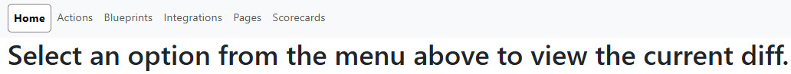

# Compare Organizations

This repository can be used to retrieve the configuration data for a given [Port](getport.io) organization, as well as comparing that configuration data to another organization (such as when confirming successful migration from one organization/environment to another).

## Getting Started

Clone the repository locally, and install dependencies:

```bash
npm install
```

Create one `.json` file per environment (Port organization) for both the source and destination in `/src/envs/`. It should follow the format prescribed in `/src/envs/README.md`.

To retrieve your clientId and clientSecret, open your [Port application}(https://app.port.io). Click on the "..." button in the top right corner, and select "Credentials". These values can be found on the "Organization" tab.

**Note:** This project is only intended to compare two environments at a time, as the output for file differences only contains a left (source) and right (destination) pane.

Execute the configuration data retrieval:

```bash
npm run dev
```

**Note:** The `dev` and `build` scripts include the `--force` flag to ensure Vite clears its cache and re-optimizes dependencies. This is necessary because the startup process dynamically generates files (including validation results) that are imported by the application. Without this flag, Vite may cache module resolution failures from previous runs when these files didn't exist yet.

Assuming two configured environments (source and dest), you should see the following file structure generated:

```
/port_organization_comparison
└── /output
    ├── /source
    │   ├── Actions.json
    │   ├── Blueprints.json
    │   ├── Integrations.json
    │   ├── Pages.json
    │   ├── Scorecards.json
    │   └── Webhooks.json
    └── /dest
    │   ├── Actions.json
    │   ├── Blueprints.json
    │   ├── Integrations.json
    │   ├── Pages.json
    │   ├── Scorecards.json
    │   └── Webhooks.json
```

Once the file generation is complete, a small web app is started:



The web app allows you to view and compare the configuration data between your source and destination organizations. Select different data types from the navigation to see detailed comparisons:


## Gathering additional types of information

By default, this project has been set up to retrieve actions, blueprints, integrations, pages, scorecards, and webhooks (a subset of integrations).

For each of these types of data, the unique portion of the endpoint URL is configured (`endpoint`), whether or not an additional endpoint for item-specific permissions exists (`hasPermissions` - if true, the process will attempt to iterate through the items and call an endpoint like `${endpoint}/${item.identifier}/permissions` to enrich the item with its configured permissions object), and which variable name to use for the items retrieved from the endpoint (`variable` - necessary because of things like the endpoint for integrations being `/integration` - singular, while the response object includes an array of `integrations` - plural).

In order to retrieve a different type of item (assuming an existing Port endpoint - see the [API reference](https://docs.port.io/api-reference/port-api) or the corresponding [Swagger API documentation](https://api.getport.io/swagger/#Pages)), just add another object to the array in [dataTypes.cjs](https://github.com/reinrl/port_organization_comparison/blob/main/src/util/dataTypes.ts). Once you have added your new type, there will be some additional work to determine how best to render the list of items (see the switch statement in `/src/components/Content` - by default `<Items>` will be used, but actions and pages both include examples of how to allow for list filtering based on an implementation-specific type if so desired).

## Excluding specific keys during comparison

When comparing configuration data between environments, you may want to exclude certain keys from the comparison. The project includes a `keysToExclude.cjs` file (stored in `/src/config`) that defines keys that should be ignored during comparison operations.

This file maintains a list of keys that are filtered out when comparing objects between environments. It's useful for:

- Removing sensitive information from the comparison
- Ignoring implementation details that differ but don't affect functionality
- Excluding properties that are expected to be different between environments
- Filtering out redundant data that isn't relevant to the comparison

You can customize the exclusion list by modifying the `keysToExclude.cjs` file:

```js
// Example of how to modify keysToExclude.cjs
const keysToExclude = [
  "_id",
  "createdAt",
  "createdBy",
  "id",
  "orgId", // expected to be different when comparing two different organizations/environments
  "updatedAt",
  "updatedBy",
  // Add your custom keys to exclude
];

module.exports = { keysToExclude };
```

The comparison tool automatically uses these settings when displaying differences between environments.

## Updating Automation Run URLs

The `updateAutomationRunUrl.cjs` utility script helps you automatically fix automation run URLs that reference incorrect Port domains. This is particularly useful when migrating automations between Port regions (e.g., from `app.port.io` to `app.us.port.io`) or when automations have been imported with incorrect domain references.

### What it does

The script:

1. Connects to your destination Port environment
2. Retrieves all actions and identifies automations with `run_url` properties
3. Compares the run URL domain with the configured Port web domain
4. Updates any automations where the protocol or domain don't match
5. Logs all activity and saves detailed results

### Usage

**Basic usage** (updates automations immediately):

```bash
npm run update-automation-run-urls
```

**Dry run mode** (preview what would be updated without making changes):

```bash
npm run update-automation-run-urls -- --dry-run
# or
npm run update-automation-run-urls -- -d
```

### Configuration

The script uses the `dest.json` configuration file from `/src/envs/` to connect to your Port environment. Make sure this file is properly configured with:

- `clientId` and `clientSecret` for authentication
- `portDomain` for the API endpoint
- `portWebDomain` for the correct web application URL that automations should reference

### Output

The script generates two files in the `/src/output/` directory:

1. **`automation_update_log.txt`** - Detailed log of the entire process with timestamps
2. **`automation_update_results.json`** - Structured results including:
   - Timestamp of execution
   - Count of successful and failed updates
   - Details for each automation (identifier, original URL, new URL, success status)

### Example Output

When automations are found and corrected:

```
[2025-10-20T18:17:04.855Z] Found 1 automation(s) that need URL correction:
[2025-10-20T18:17:04.855Z]   1. create_action_run_link_dbt_project_prod: https://app.port.io/organization/run?runId={{.event.diff.after.id}}
[2025-10-20T18:17:04.855Z] Starting update process for 1 automation(s)...
[2025-10-20T18:17:04.855Z] Updating create_action_run_link_dbt_project_prod: https://app.port.io/organization/run?runId={{.event.diff.after.id}} → https://app.us.port.io/organization/run?runId={{.event.diff.after.id}}
[2025-10-20T18:17:04.982Z] Successfully updated automation: create_action_run_link_dbt_project_prod
[2025-10-20T18:17:04.986Z] Process completed successfully: 1/1 automations updated
```

When all automations are already correct:

```
[2025-10-20T18:17:14.830Z] ✅ All automation run URLs are already correct! No work to do.
```

### Best Practices

1. **Always run in dry-run mode first** to preview changes before applying them
2. **Review the log files** after execution to confirm expected changes were made
3. **Keep the results JSON file** for audit purposes and to track which automations were updated
4. **Re-run the script** after updates to verify all automations are now correct

## Validating Page Widget Configurations

The `validatePages.cjs` utility script helps you identify misconfigured page widgets by validating widget property references against your blueprint schemas. This is particularly useful when migrating pages between environments, refactoring blueprints, or troubleshooting page display issues.

### What it does

The script:

1. Reads blueprint and page configuration data from the `/src/output/` directory
2. Builds a registry of valid properties and relations for each blueprint
3. Validates all widget configurations on each page, including:
   - Property references in table columns and filters
   - Relation paths in dataset rules and `relatedTo` operators
   - Blueprint references in widget configurations
   - Nested widgets within dashboard and grouper widgets
4. Reports violations with detailed context (widget type, widget title, property name, location)
5. Logs all activity and saves structured validation results

### Usage

**Validate all environments**:

```bash
npm run validate-pages
```

**Validate a specific environment**:

```bash
npm run validate-pages -- --env=source
# or
npm run validate-pages -- --env=dest
```

**Verbose mode** (show detailed logging for debugging):

```bash
npm run validate-pages -- --verbose
```

**Combined flags**:

```bash
npm run validate-pages -- --env=dest --verbose
```

### Command-Line Options

- `--env=<name>` - Validate only the specified environment (e.g., `source` or `dest`)
- `--verbose` - Enable detailed logging including blueprint registration and property extraction details

### Prerequisites

The script validates pages using previously fetched configuration data. Before running the validation:

1. Ensure you've run `npm run dev` to fetch the latest configuration data
2. Verify that `Blueprints.json` and `Pages.json` exist in `/src/output/<env>/` for the environments you want to validate

### Output

The script generates two files in the `/src/output/` directory:

1. **`page_validation_log.txt`** - Detailed log of the validation process with timestamps
2. **`page_validation_results.json`** - Structured validation results including:
   - Timestamp and command-line arguments used
   - Per-page results with violations and warnings
   - Summary statistics (total pages, pages with errors, violation counts by type)
   - Widget counts for each page (including nested widgets)

### Example Output

Console output during validation:

```
[2025-11-25T10:30:00.000Z] [INFO] === Page Validation Started ===
[2025-11-25T10:30:00.000Z] [INFO] Command-line args: verbose=false, env=dest
[2025-11-25T10:30:00.000Z] [INFO] Discovered 1 environment(s): dest
[2025-11-25T10:30:00.000Z] [INFO] Loaded 150 blueprints and 250 pages
[2025-11-25T10:30:01.000Z] [INFO]
--- Summary for dest ---
[2025-11-25T10:30:01.000Z] [INFO] Pages validated: 250
[2025-11-25T10:30:01.000Z] [INFO] Pages with errors: 12
[2025-11-25T10:30:01.000Z] [INFO] Total violations: 35
[2025-11-25T10:30:01.000Z] [INFO] Violations by type:
[2025-11-25T10:30:01.000Z] [INFO]   - invalid_property: 28
[2025-11-25T10:30:01.000Z] [INFO]   - missing_blueprint: 7
```

Sample violation in `page_validation_results.json`:

```json
{
  "widgetType": "table-entities-explorer",
  "widgetTitle": "My Services",
  "blueprintIdentifier": "service",
  "invalidProperty": "oldPropertyName",
  "locationType": "blueprintConfig.propertiesSettings",
  "violationType": "invalid_property",
  "message": "Property \"oldPropertyName\" does not exist on blueprint \"service\""
}
```

### Understanding Violations

**Violation Types:**

- **`invalid_property`** - A property, mirror property, calculation property, aggregation property, or relation referenced in a widget doesn't exist on the specified blueprint
- **`missing_blueprint`** - A widget references a blueprint that doesn't exist in your organization

**Location Types:**

- **`blueprintConfig.propertiesSettings`** - Invalid property in table column configuration
- **`blueprintConfig.filterSettings`** - Invalid property in filter/search rules
- **`dataset.rules.relatedTo`** - Invalid blueprint or relation in `relatedTo` operator
- **`dataset.rules.property`** - Invalid property in dataset filter rules

**Rule Nesting Level:**

When violations occur in nested filter rules, the `ruleNestingLevel` field indicates the depth (0 = top level, 1 = first nested level, etc.).

### Common Issues Found

1. **Outdated property names** - Properties renamed or removed from blueprints
2. **Missing relations** - Relation paths that reference non-existent relations
3. **Blueprint mismatches** - Widgets configured for the wrong blueprint
4. **Migration artifacts** - Properties from source environment not present in destination
5. **Typos** - Misspelled property or blueprint names

### Best Practices

1. **Run after data fetches** - Always validate after running `npm run dev` to ensure you're checking current configurations
2. **Review before migration** - Validate source environment before migration to identify issues early
3. **Validate both environments** - Compare violations between source and dest to understand differences
4. **Use verbose mode for debugging** - When investigating specific issues, use `--verbose` to see detailed processing logs
5. **Keep validation results** - Store the JSON output for tracking configuration health over time

### Notes

- The validation skips template variables (e.g., `{{blueprint}}`) and doesn't validate their correctness
- Complex JQ expressions in property paths are flagged as warnings for manual review
- Nested widgets (in dashboard-widget and grouper widgets) are fully validated and counted
- Relations can be used directly as displayable properties in table-entities-explorer widgets

## Troubleshooting

### General tips

Efforts have been made to both log helpful information to the console and write a log file (`/src/output/logging.txt`) containing the console output as well.

### Troubleshooting configuration retrieval errors

If a given organization's clientId and/or clientSecret are not correct (or some other error occurs while attempting to retrieve an access token), you should see an error like the following:

```bash
$ npm run dev

> port_organization_comparison@1.1.0 dev
> node src/index.js

Error processing environment "source": Failed to fetch access token for environment "source":
```

If the request response is successfull retrieved, but does not contain the expected access token, you should see an error like the following:

```bash
$ npm run dev

> port_organization_comparison@1.1.0 dev
> node src/index.js

Error processing environment "source": Invalid response from access token API
```

An error retrieving one of the specified data endpoints should result in an error like the following:

```bash
$ npm run dev

> port_organization_comparison@1.1.0 dev
> node src/index.js

Error fetching data from endpoint "/notgood" for environment "source": Request failed with status code 404 (will not write integrations.json)
```

An incorrect variable configured for the response array to return:

```bash
$ npm run dev

> port_organization_comparison@1.1.0 dev
> node src/index.js

Error fetching data from endpoint "/notgood" for environment "source": Incorrect response array variable name specified (will not write integration.json)
```

Any error encountered while processing the response from one of specified data endpoints should result in an error like the following:

```bash
$ npm run dev

> port_organization_comparison@1.1.0 dev
> node src/index.js

Error writing file for "notgood" in environment "source": Cannot read properties of undefined (reading 'sort')
```

There are some expected errors that might be written out during permission data retrieval attempts:

```bash
Error fetching additional data for item ID "serviceEntity" from endpoint "https://api.us.port.io/v1/pages/serviceEntity/permissions" in environment "dest": Request failed with status code 403
```

There are actually several different reasons why the permission retrieval subprocess might legitimately hit an error. These can include a page not actually being a Software Catalog page (so it doesn't have a permissions object - instead returning an `HTTP 403` with a message like `Page \"dbt_destinationsEntity\" is not a Software Catalog page.`), or an action returned in the actions array not actually being a self-service action (which returns an `HTTP 422` with a message like `Cannot manage permissions for non self service action`).
